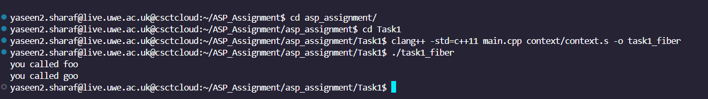
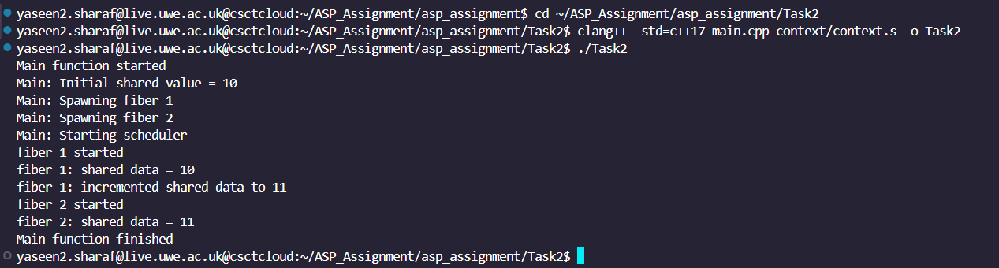
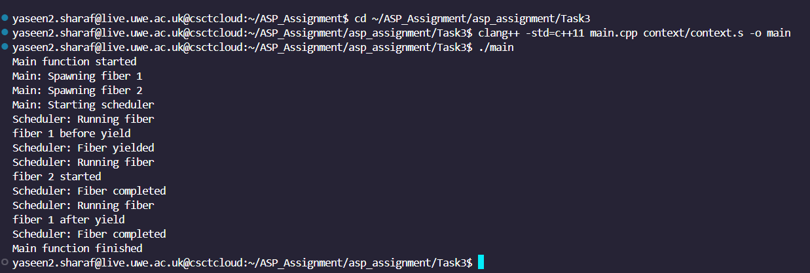

# ASP Assignment
This assignment focuses on designing and implementing a lightweight Fiber Scheduler in C++ to manage cooperative multitasking efficiently. A fiber scheduler enables user-space tasks (fibers) to yield control explicitly, allowing efficient task switching without the overhead associated with traditional kernel threads. This makes it especially effective for workloads that involve frequent task switching or shared data management within a single thread.

The project consists of three main tasks:

Task 1: Implement basic context switching to enable transitions between different fibers. This task introduces saving and restoring execution states (instruction and stack pointers) to demonstrate fundamental context-switching operations.

Task 2: Develop a fiber abstraction layer and a simple round-robin scheduler. This involves creating a Fiber class to manage execution contexts and integrating a scheduler to manage multiple fibers running sequentially.

Task 3: Extend the scheduler to support yielding control back to the scheduler before completion, allowing fibers to run cooperatively. This task includes managing shared data between fibers and dynamic execution patterns.
s
## Getting started
```bash
git clone https://gitlab.uwe.ac.uk/y2-sharaf/asp_assignment
```
### Prerequisites
Ensure you have the following installed on your system:

C++17 compatible compiler (e.g., g++ or clang++)


## Task 1:

Task 1 focuses on implementing context switching in C++, which forms the foundation of a lightweight fiber scheduler. This task involves saving and restoring the execution state of fibers, enabling seamless transitions between tasks running in the same thread. The implementation demonstrates stack management and context manipulation, which are key to cooperative multitasking.


### Compilation & Execution
To compile and run the code, use the following commands:

Navigate to Task1
```Bash
cd ~/ASP_Assignment/asp_assignment/Task1
```

Compile the program using the following command:


```C++
clang++ -std=c++11 main.cpp context/context.s -o task1_fiber
```
Run the Program:
```C++
./task1_fiber
```

## Context.hpp 
```c++
#pragma once

struct Context {
  void *rip, *rsp;
  void *rbx, *rbp, *r12, *r13, *r14, *r15;
};

extern "C" int get_context(Context *c);
extern "C" void set_context(Context *c);
extern "C" void swap_context(Context *out, Context *in);
```
The context.hpp file defines the Context structure and essential functions for managing low-level CPU contexts, enabling seamless context switching in fibers. The Context structure includes the instruction pointer (rip), stack pointer (rsp), and general-purpose registers (rbx, rbp, r12, r13, r14, r15), encapsulating the CPU state required for restoring execution. The functions get_context, set_context, and swap_context handle context management: capturing the current execution state, restoring a saved state, and switching between two states, respectively. The extern "C" declaration ensures compatibility with C-style linking, allowing these functions to be implemented in assembly for precise control over CPU operations. This setup is critical for efficient fiber-based cooperative multitasking. 

## main.cpp
```c++
#include <iostream>
#include "context/context.hpp"  

// Global context for `goo`
Context gooContext;

// Implementation of `foo` function
void foo() {
    std::cout << "you called foo" << std::endl;
    set_context(&gooContext);  // Switch to `gooContext`
}

// Implementation of `goo` function
void goo() {
    std::cout << "you called goo" << std::endl;
    exit(0);  // End the program after goo finishes
}

int main() {
    // Allocate stacks for `foo` and `goo`, each with 4096 bytes
    char fooStack[4096];
    char gooStack[4096];

    // Align stack pointers to 16 bytes and account for the Red Zone
    char* fooSP = fooStack + sizeof(fooStack);  // Point to the top of `foo` stack
    fooSP = reinterpret_cast<char*>(reinterpret_cast<uintptr_t>(fooSP) & -16L);  // Align to 16 bytes
    fooSP -= 128;  // Account for 128-byte Red Zone

    char* gooSP = gooStack + sizeof(gooStack);  // Point to the top of `goo` stack
    gooSP = reinterpret_cast<char*>(reinterpret_cast<uintptr_t>(gooSP) & -16L);  // Align to 16 bytes
    gooSP -= 128;  // Account for 128-byte Red Zone

    // Set up contexts for `foo` and `goo`
    Context fooContext;
    fooContext.rip = reinterpret_cast<void*>(foo);  // Set instruction pointer to `foo`
    fooContext.rsp = fooSP;  // Set stack pointer for `foo`

    gooContext.rip = reinterpret_cast<void*>(goo);  // Set instruction pointer to `goo`
    gooContext.rsp = gooSP;  // Set stack pointer for `goo`

    // Start execution in `foo`
    set_context(&fooContext);

    // This line will not be reached because `goo` exits the program
    return 0;
}
```


## Detailed Implementation

### Global Context for goo

```c++
#include <iostream>
#include "context/context.hpp"  

// Global context for `goo`
Context gooContext;
```

The gooContext is a global variable that holds the execution state of the goo fiber. This state includes critical components like the instruction pointer (rip), stack pointer (rsp), and general-purpose registers. By declaring gooContext globally, it becomes accessible and modifiable throughout the program. This design enables seamless transitions to the goo fiber from other fibers, such as foo, ensuring smooth cooperative multitasking. The global declaration is especially useful for managing and restoring execution states efficiently in a controlled single-threaded environment.


### Foo Function: Printing and Switching to Goo
```c++
// Implementation of `foo` function
void foo() {
    std::cout << "you called foo" << std::endl;
    set_context(&gooContext);  // Switch to `gooContext`
}
```
The foo function begins by printing a message—"you called foo"—indicating its execution. Following this, it explicitly hands over control to the goo fiber using set_context(&gooContext). This operation saves the current state of foo and switches execution to the goo fiber by restoring the gooContext. This explicit context switching highlights the cooperative multitasking model, where fibers voluntarily yield control to one another, rather than relying on a preemptive scheduler.

### Goo Function: Printing and Program Termination
```c++
// Implementation of `goo` function
void goo() {
    std::cout << "you called goo" << std::endl;
    exit(0);  // End the program after goo finishes
}

```
The goo function prints "you called goo" to signal the start of its execution. Afterward, it terminates the entire program by calling exit(0), ensuring no further execution occurs. This design eliminates the need to return control to foo or main, as goo represents the final state of execution. The termination in goo highlights the program’s cooperative multitasking model, where each fiber runs until it either completes its task or explicitly switches control.


### Main Function: Fiber Setup and Execution
```c++
int main() {
    // Allocate stacks for `foo` and `goo`, each with 4096 bytes
    char fooStack[4096];
    char gooStack[4096];

    // Align stack pointers to 16 bytes and account for the Red Zone
    char* fooSP = fooStack + sizeof(fooStack);  // Point to the top of `foo` stack
    fooSP = reinterpret_cast<char*>(reinterpret_cast<uintptr_t>(fooSP) & -16L);  // Align to 16 bytes
    fooSP -= 128;  // Account for 128-byte Red Zone

    char* gooSP = gooStack + sizeof(gooStack);  // Point to the top of `goo` stack
    gooSP = reinterpret_cast<char*>(reinterpret_cast<uintptr_t>(gooSP) & -16L);  // Align to 16 bytes
    gooSP -= 128;  // Account for 128-byte Red Zone

    // Set up contexts for `foo` and `goo`
    Context fooContext;
    fooContext.rip = reinterpret_cast<void*>(foo);  // Set instruction pointer to `foo`
    fooContext.rsp = fooSP;  // Set stack pointer for `foo`

    gooContext.rip = reinterpret_cast<void*>(goo);  // Set instruction pointer to `goo`
    gooContext.rsp = gooSP;  // Set stack pointer for `goo`

    // Start execution in `foo`
    set_context(&fooContext);

    // This line will not be reached because `goo` exits the program
    return 0;
}
```
The main function initializes and executes the fibers by allocating independent 4096-byte stacks for foo and goo, ensuring each fiber has dedicated memory for its function calls and local variables. To comply with the System V AMD64 ABI, the stack pointers (rsp) are aligned to 16-byte boundaries with an additional 128-byte adjustment for the "Red Zone," ensuring safe stack usage. The fooContext and gooContext structures are configured with their respective instruction pointers (rip) pointing to the foo and goo functions, and stack pointers (rsp) set to the top of their allocated stacks. Execution begins with foo when set_context(&fooContext) is called, switching the CPU to the foo fiber. After completing its task, foo transfers control to goo, which executes and terminates the program using exit(0). This setup showcases explicit fiber management and demonstrates the core principles of cooperative multitasking.

## Expected Output 



The output demonstrates the successful implementation of context switching using fibers in C++. The program begins by executing the foo function, which prints the message "you called foo" to indicate its execution. Within foo, the set_context function transfers control to the goo function. The goo function then prints "you called goo" to confirm that control has been switched successfully, and it terminates the program using exit(0). This seamless transition between foo and goo, as reflected in the output, highlights the efficiency of saving and restoring execution states within a single-threaded environment, showcasing the foundational principles of cooperative multitasking.


## Task 2: Fiber Abstraction Layer and Round-Robin Scheduler

Task 2 builds on the foundation laid in Task 1 by introducing a fiber abstraction layer and implementing a simple round-robin scheduler. This task uses the Fiber class to encapsulate individual fibers' state and stack management, while the Scheduler class handles execution sequencing. This setup demonstrates cooperative multitasking in C++ within a single-threaded environment, focusing on shared data management and dynamic task switching.

### Key Objectives

Fiber Abstraction Layer: Introduce a Fiber class to encapsulate the stack, execution context, and optional shared data for each fiber. This modular design simplifies the creation, management, and reuse of fibers.

Round-Robin Scheduling: Implement a simple, fair scheduling mechanism that executes multiple fibers sequentially in a loop until all fibers complete execution, ensuring efficient resource utilization.

Shared Data Management: Demonstrate communication between fibers using a shared data pointer, enabling interaction and showcasing the potential for cooperative multitasking in interdependent tasks.

### Compilation & Execution
To compile and run the program for Task 2, follow these steps:


Navigate to the Task2 directory:

```Bash
cd ~/ASP_Assignment/asp_assignment/Task2

```
Compile the program:

```C++
clang++ -std=c++17 main.cpp context/context.s -o Task2
```
Run the Program:
```C++
./Task2
```
## Fiber.hpp

```c++
#pragma once
#include "context/context.hpp"
#include <cstdint>

// Fiber class represents a lightweight, user-space thread with its own stack and execution context
class Fiber {
public:
    // Constructor: Initializes a fiber with a function pointer and optional shared data
    Fiber(void (*func)(), int* data = nullptr)
        : func_(func), data_(data), stack_(new char[4096]) {  // Allocate 4096 bytes for the stack
        sp_ = stack_ + 4096;  // Point to the top of the stack
        sp_ = reinterpret_cast<char*>(reinterpret_cast<uintptr_t>(sp_) & -16L) - 128;  // Align stack to 16 bytes and adjust for Red Zone
        context_.rip = reinterpret_cast<void*>(func_);  // Set the instruction pointer to the fiber's function
        context_.rsp = sp_;  // Set the stack pointer to the top of the aligned stack
    }

    // Destructor: Frees the dynamically allocated stack
    ~Fiber() { delete[] stack_; }

    // Returns the execution context of the fiber
    Context& get_context() { return context_; }

    // Returns a pointer to the shared data, if any
    int* get_data() { return data_; }

private:
    void (*func_)();       // Pointer to the function executed by the fiber
    Context context_;      // Stores the fiber's CPU context (registers and stack pointer)
    char* sp_;             // Pointer to the top of the fiber's aligned stack
    char* stack_;          // Dynamically allocated memory for the fiber's stack
    int* data_;            // Optional pointer to shared data for communication between fibers
};
```
The Fiber class abstracts the low-level details of creating and managing fibers by encapsulating the stack, execution context, and an optional shared data pointer. Each fiber is associated with a unique function (func) and a stack of 4096 bytes, dynamically allocated to store function calls and local variables. The stack pointer (sp_) is aligned to 16 bytes and adjusted for the Red Zone to comply with system ABI standards, ensuring compatibility and efficient memory usage. The context structure (context_) tracks the instruction pointer (rip) and stack pointer (rsp), enabling seamless saving and restoration of the fiber's state. This design simplifies multitasking by isolating the complexities of stack management, making fibers modular and reusable.

## Scheduler.hpp

```c++
#pragma once
#include <deque>
#include "fiber.hpp"
#include "context/context.hpp"

// The Scheduler class manages the execution of fibers in a cooperative multitasking system
class Scheduler {
public:
    // Add a new fiber to the scheduler's queue
    void spawn(Fiber* fiber) {
        fibers_.push_back(fiber);  // Add the fiber to the end of the queue
    }

    // Execute all fibers in the queue sequentially
    void do_it() {
        get_context(&main_context_);  // Save the current context (main) to allow returning here later
        while (!fibers_.empty()) {    // Continue until all fibers are executed
            Fiber* fiber = fibers_.front();  // Get the next fiber in the queue
            fibers_.pop_front();      // Remove the fiber from the queue
            current_fiber_ = fiber;   // Set the current fiber being executed
            set_context(&fiber->get_context());  // Switch to the fiber's context and start execution
        }
    }

    // Called when a fiber finishes its task to return to the main context
    void fiber_exit() {
        set_context(&main_context_);  // Restore the main context, resuming execution in the scheduler
    }

    // Retrieve the shared data pointer of the currently running fiber
    int* get_data() {
        return current_fiber_ ? current_fiber_->get_data() : nullptr;  // Return data if a fiber is active
    }

private:
    std::deque<Fiber*> fibers_;       // Queue of fibers to execute
    Context main_context_;            // Stores the execution context of the main function
    Fiber* current_fiber_ = nullptr;  // Pointer to the fiber currently being executed
};

// Global instance of the Scheduler class, enabling fibers to access shared functions
extern Scheduler scheduler;

// Inline helper function for fibers to signal their completion
inline void fiber_exit() { scheduler.fiber_exit(); }

// Inline helper function to access shared data from the currently running fiber
inline int* get_data() { return scheduler.get_data(); }

```
The Scheduler class manages the execution of multiple fibers using a round-robin scheduling mechanism. Fibers are added to the execution queue via the spawn() method. The do_it() function drives the scheduling process: it saves the main program’s context and iteratively switches control to each fiber in the queue using set_context(). Once a fiber completes, control is returned to the scheduler, and the next fiber is executed. Shared data is managed through get_data(), allowing fibers to access and modify shared variables. The fiber_exit() function ensures proper cleanup by returning control to the main context when a fiber finishes execution. This scheduler demonstrates cooperative multitasking, where fibers yield control explicitly, enabling efficient task management in a single-threaded environment.

## Main.cpp: Demonstration of Fiber Scheduler

```c++
//main.cpp
#include <iostream>
#include "fiber.hpp"
#include "scheduler.hpp"

// Define the global scheduler
Scheduler scheduler;

// Fiber function 1
void func1() {
    std::cout << "fiber 1 started" << std::endl;
    int* shared_data = get_data();
    if (shared_data) {
        std::cout << "fiber 1: shared data = " << *shared_data << std::endl;
        (*shared_data)++;  // Increment the shared data
        std::cout << "fiber 1: incremented shared data to " << *shared_data << std::endl;
    }
    fiber_exit();
}

// Fiber function 2
void func2() {
    std::cout << "fiber 2 started" << std::endl;
    int* shared_data = get_data();
    if (shared_data) {
        std::cout << "fiber 2: shared data = " << *shared_data << std::endl;
    }
    fiber_exit();
    
}

int main() {
    std::cout << "Main function started" << std::endl;

    int shared_value = 10;  // Shared data between fibers
    std::cout << "Main: Initial shared value = " << shared_value << std::endl;

    // Create fiber instances with shared data
    Fiber f1(func1, &shared_value);
    Fiber f2(func2, &shared_value);

    // Spawn the fibers in the scheduler
    std::cout << "Main: Spawning fiber 1" << std::endl;
    scheduler.spawn(&f1);

    std::cout << "Main: Spawning fiber 2" << std::endl;
    scheduler.spawn(&f2);

    // Start the scheduler to run the fibers
    std::cout << "Main: Starting scheduler" << std::endl;
    scheduler.do_it();

    std::cout << "Main function finished" << std::endl;
    return 0;
}


```
The main.cpp file demonstrates the functionality of the fiber abstraction layer and round-robin scheduler. It initializes two fibers (func1 and func2) and a shared integer variable (shared_value). The fibers are added to the scheduler queue using spawn() and executed sequentially using do_it(). The first fiber (func1) prints the shared value, increments it, and exits. The second fiber (func2) reads and prints the updated shared value before exiting. This interaction demonstrates cooperative multitasking and efficient shared data management. The program concludes by returning control to the main thread and printing a completion message.

## Expected Output 


The output demonstrates the successful execution of Task 2, showcasing the functionality of the fiber abstraction layer and the round-robin scheduler. The program begins by initializing a shared variable (shared_value) with a value of 10 and creating two fibers (func1 and func2), both linked to the shared variable. These fibers are added to the scheduler's queue and executed sequentially. Fiber 1 starts by printing the initial shared value, increments it to 11, and then exits, yielding control back to the scheduler. Fiber 2 then starts, prints the updated shared value of 11, and also exits. Once all fibers complete, control returns to the main function, which prints a completion message. This output demonstrates cooperative multitasking, effective inter-fiber communication through shared data, and fair scheduling using the round-robin mechanism, validating the successful implementation of Task 2.

## Task 3: Enhanced Fiber Scheduler with Yielding Mechanism

Task 3 advances the fiber scheduler from Task 2 by adding the capability for fibers to yield control back to the scheduler during execution. This feature enables cooperative multitasking, allowing fibers to pause voluntarily and give others in the queue an opportunity to execute. After other fibers complete, the paused fiber resumes seamlessly from its previous state. This enhancement significantly improves the scheduler's flexibility, making it ideal for workloads that demand efficient task coordination or shared resource management.


### Key Objectives
Yielding Mechanism: Introduce the capability for fibers to voluntarily yield control back to the scheduler during execution, enabling other fibers in the queue to execute. This mechanism promotes efficient task sharing and responsiveness in cooperative multitasking.

Seamless Task Resumption: Ensure that fibers paused via the yielding mechanism can resume execution from their previous state once other fibers in the queue complete, maintaining smooth task progression.

Dynamic Execution Queue Management: Enhance the scheduler's logic to dynamically re-add yielded fibers to the execution queue while removing completed ones, enabling effective and flexible task coordination.

### Compilation & Execution
To compile and run the program for Task 2, follow these steps:


Navigate to the Task3 directory:

```Bash
cd ~/ASP_Assignment/asp_assignment/Task3
```
Compile the program:

```C++
clang++ -std=c++11 main.cpp context/context.s -o main
```
Run the Program:
```C++
./main
```

## Fiber.hpp

```c++
#pragma once
#include "context/context.hpp"
#include <cstdint>

// Fiber class: Represents a lightweight, user-space thread with its own stack and execution context
class Fiber {
public:
    // Constructor: Initializes a fiber with a function pointer and optional shared data
    Fiber(void (*func)(), int* data = nullptr)
        : func_(func), data_(data), stack_(new char[4096]), done_(false) {  // Allocate 4096 bytes for the stack
        sp_ = stack_ + 4096;  // Point to the top of the stack
        sp_ = reinterpret_cast<char*>(reinterpret_cast<uintptr_t>(sp_) & -16L) - 128;  // Align stack to 16 bytes and adjust for Red Zone
        context_.rip = reinterpret_cast<void*>(func_);  // Set the instruction pointer to the fiber's function
        context_.rsp = sp_;  // Set the stack pointer to the top of the aligned stack
    }

    // Destructor: Frees the dynamically allocated stack memory
    ~Fiber() { delete[] stack_; }

    // Returns the execution context of the fiber
    Context& get_context() { return context_; }

    // Returns a pointer to the shared data, if any
    int* get_data() { return data_; }

    // Mark the fiber as completed
    void mark_done() { done_ = true; }

    // Check if the fiber has completed execution
    bool is_done() const { return done_; }

private:
    void (*func_)();       // Pointer to the function executed by the fiber
    Context context_;      // Stores the fiber's CPU context (instruction and stack pointers)
    char* sp_;             // Pointer to the top of the fiber's aligned stack
    char* stack_;          // Dynamically allocated memory for the fiber's stack
    int* data_;            // Optional pointer to shared data for communication between fibers
    bool done_;            // Flag to track if the fiber has completed execution
};

```
In Fiber.hpp, the implementation remains largely the same as in Task 2, encapsulating a fiber's stack, context, and optional shared data. The new addition in Task 3 is the introduction of the done_ flag, which tracks whether a fiber has completed execution. This is managed by two new methods, mark_done() and is_done(), which enable the scheduler to determine whether a fiber should be re-added to the execution queue or excluded, thus supporting the new yielding mechanism and ensuring more efficient task management.

## Scheduler.hpp

```c++
#pragma once
#include <deque>
#include "fiber.hpp"
#include "context/context.hpp"
#include <iostream>

// Scheduler class: Manages execution of fibers in a cooperative multitasking system
class Scheduler {
public:
    // Add a new fiber to the scheduler's queue
    void spawn(Fiber* fiber) {
        fibers_.push_back(fiber);  // Append the fiber to the end of the queue
    }

    // Execute all fibers in the queue sequentially
    void do_it() {
        get_context(&main_context_);  // Save the current (main) context for later restoration
        while (!fibers_.empty()) {    // Continue until all fibers have been executed
            Fiber* fiber = fibers_.front();  // Get the next fiber in the queue
            fibers_.pop_front();             // Remove the fiber from the front of the queue
            current_fiber_ = fiber;          // Set the current fiber being executed

            std::cout << "Scheduler: Running fiber\n";
            swap_context(&main_context_, &fiber->get_context());  // Switch to the fiber's context

            // If the fiber is not completed, re-add it to the queue for future execution
            if (!fiber->is_done()) {
                fibers_.push_back(fiber);
            }
        }
    }

    // Mark the current fiber as completed and return control to the main context
    void fiber_exit() {
        current_fiber_->mark_done();  // Mark the current fiber as done
        std::cout << "Scheduler: Fiber completed\n";
        set_context(&main_context_);  // Restore the main context
    }

    // Yield execution of the current fiber and return control to the scheduler
    void yield() {
        std::cout << "Scheduler: Fiber yielded\n";
        swap_context(&current_fiber_->get_context(), &main_context_);  // Save fiber state and restore main context
    }

    // Retrieve shared data from the currently running fiber
    int* get_data() {
        return current_fiber_ ? current_fiber_->get_data() : nullptr;  // Return the fiber's shared data pointer if available
    }

private:
    std::deque<Fiber*> fibers_;       // Queue of fibers to be executed
    Context main_context_;            // Stores the main program's execution context
    Fiber* current_fiber_ = nullptr;  // Pointer to the fiber currently being executed
};

// Global instance of the Scheduler class, allowing fibers to access shared functions
extern Scheduler scheduler;

// Helper function for fibers to signal completion and return control to the scheduler
inline void fiber_exit() { 
    scheduler.fiber_exit(); }

// Helper function to allow a fiber to yield control voluntarily
inline void yield() { scheduler.yield(); }

// Helper function to access shared data from the currently running fiber
inline int* get_data() { return scheduler.get_data(); }

```


In Scheduler.hpp, the implementation extends Task 2's sequential fiber execution by introducing enhanced functionality for dynamic multitasking. A new yield() method enables fibers to voluntarily pause their execution and return control to the scheduler, facilitating cooperative multitasking. Additionally, the do_it() method has been refined to manage the execution queue dynamically, re-adding yielded fibers for future execution while removing fibers marked as completed using the done_ flag. These improvements significantly enhance the scheduler's flexibility, enabling efficient sharing of execution time among fibers and better supporting scenarios that require intermediate task switching or resource coordination.

## main.cpp
```c++
#include <iostream>
#include "fiber.hpp"
#include "scheduler.hpp"

// Define the global scheduler
Scheduler scheduler;

// Fiber function 1
void func1() {
    std::cout << "fiber 1 before yield\n";
    yield();
    std::cout << "fiber 1 after yield\n";
    fiber_exit();
}

// Fiber function 2
void func2() {
    std::cout << "fiber 2 started\n";
    fiber_exit();
}

int main() {
    std::cout << "Main function started\n";

    // Create fiber instances
    Fiber f1(func1);
    Fiber f2(func2);

    // Spawn the fibers in the scheduler
    std::cout << "Main: Spawning fiber 1\n";
    scheduler.spawn(&f1);

    std::cout << "Main: Spawning fiber 2\n";
    scheduler.spawn(&f2);

    // Start the scheduler to run the fibers
    std::cout << "Main: Starting scheduler\n";
    scheduler.do_it();

    std::cout << "Main function finished\n";
    return 0;
}
```
In main.cpp, the program demonstrates the enhanced fiber scheduler's capability with the yield() mechanism, enabling cooperative multitasking. Two fibers, func1 and func2, are defined. func1 executes a portion of its code, pauses by calling yield(), and later resumes seamlessly from where it left off, while func2 executes its task without yielding and exits using fiber_exit(). The main function initializes the scheduler, creates and spawns the fibers into the scheduler's queue, and starts their execution. The scheduler dynamically manages the fibers' states, resuming paused fibers and ensuring all tasks are completed. This process highlights the scheduler's flexibility in handling task coordination, allowing fibers to share execution time effectively.


## Expected Output 


The output demonstrates the fiber scheduler’s ability to manage cooperative multitasking. The program initializes the scheduler and adds two fibers (func1 and func2) to the queue. func1 starts, prints "fiber 1 before yield," and pauses using yield(). The scheduler then switches to func2, which completes, prints "fiber 2 started," and exits. The scheduler resumes func1, which completes by printing "fiber 1 after yield." Once all fibers are executed, the program concludes, showcasing the scheduler's capability to manage yielding, resuming, and efficient task coordination